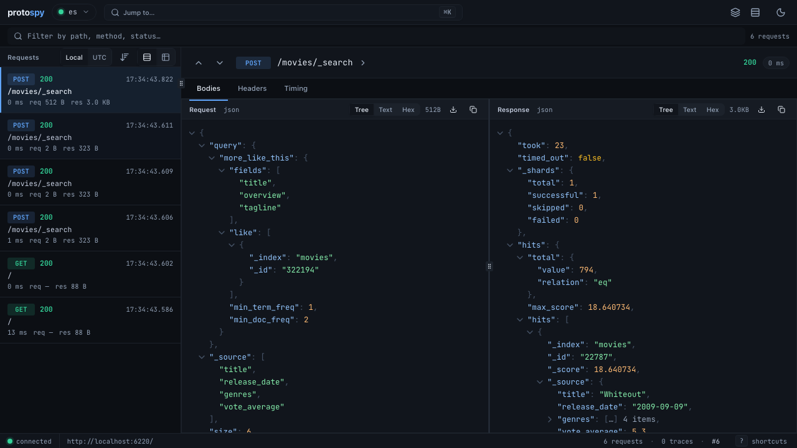

# protospy

This is a Rust monitoring proxy for development use, to give a live view of HTTP traffic between services with OpenTelemetry integration.

It currently contains:

- protospy itself, a Rust application; see `src/`.
- a Python demo application, ElasticFlix (see [its README.md](flix/README.md)), in `flix/`, which searches a movie database in Elasticsearch.
- a Docker Compose configuration to run the demo application, Elasticsearch, and Jaeger.
- an HTTP proxy conformance test suite to validate proxy behavior, intended for protospy and using Caddy and HAProxy as reference points. See [docs](docs/conformance-tests.md).



## Demo usage

### Start services

First, bring up the container services:

```shell
docker compose up -d elasticsearch jaeger flix
```

Load the movie data into Elasticsearch (one-time):

```shell
docker compose run --rm flix python loader.py
```

Then bring up protospy:

```shell
just run
```

And its UI:

```shell
just ui
```

### Observe traffic

1. Go to the protospy interface at http://localhost:3101/.
2. In another window, go to the demo Elasticflix application at http://localhost:8001/.
3. Search for movies in Elasticflix and observe that traffic appears in protospy.
4. Select HTTP exchanges and see their request and response bodies, as well as headers.

OpenTelemetry data is available in Jaeger at http://localhost:16686/.

## Configuration

protospy is designed to run containerized, with environment-variable-based 12-factor configuration. It can run multiple proxy services, each listening on its own port and forwarding traffic to its own target; these are named, with their settings under the `PROXY__<name>__` prefix, with double underscores.

Proxy settings:

- `PROXY__<name>__PORT`: port to listen on
- `PROXY__<name>__ADDR`: (optional) address to listen on, defaults to all (`[::]`)
- `PROXY__<name>__TARGET`: URL to connect to; a bare `host:port`, e.g. `db:9200`, will be interpreted as an HTTP URL

Server settings:

- `LISTEN_PORT`: port to listen on for UI
- `LISTEN_ADDR`: (optional) address to listen on for UI, defaults to all (`[::]`)
- `WEB`: enable UI web interface, defaults to true
- `PRINT_MESSAGES`: print HTTP exchanges to stdout

Server settings for development:

- `TOKIO_CONSOLE`: enable monitoring with [tokio-console][]
- `RECORD_EXAMPLES`: write requests and responses to the specified directory, to generate e.g. `docs/examples/`

[tokio-console]: https://github.com/tokio-rs/console

## Development

See the READMEs of the supporting components for their own specifics:

- [flix/README.md](flix/README.md)
- [conformance/README.md](conformance/README.md)
- [ui/README.md](ui/README.md)

Agent-assisted development workflows are documented in
[docs/agent-dev.md](docs/agent-dev.md).

### Dependencies

#### Root project

- **Rust** 1.88+ — the proxy is written in Rust; install via [rustup](https://rustup.rs)
- **Docker Compose** — runs the demo services (Elasticsearch, Jaeger, ElasticFlix)
- **[just](https://just.systems)** — task runner used for build, run, and publish recipes
- **[pre-commit](https://pre-commit.com)** — commit-time lint, format, and validation hooks; install hooks after cloning (see [Setup](#setup))

Additional Rust tools used in development:

```shell
cargo install cargo-audit --locked   # dependency vulnerability audit
cargo install cargo-tarpaulin --locked  # code coverage
```

#### ui/ — React frontend

- **Node.js** 22+ — JavaScript runtime
- **pnpm** 10+ — package manager (`npm install -g pnpm` or via [pnpm docs](https://pnpm.io/installation))

See [ui/README.md](ui/README.md) for setup and dev commands.

#### flix/ — ElasticFlix demo app

- **Docker** with **Compose** plugin — for running the Elasticsearch container (same Docker Compose install as the root project)
- **uv** — Python package manager ([install](https://docs.astral.sh/uv/getting-started/installation/))
- **Python** 3.14+ — managed by `uv`; no separate install needed if using `uv`

See [flix/README.md](flix/README.md) for setup.

#### conformance/ — HTTP conformance test suite

- **uv** — Python package manager (same as above)
- **Python** 3.14+ — managed by `uv`
- **Caddy** 2.11.3+ and **HAProxy** 3.2+ — reference proxy binaries, required only when running `--proxy caddy`, `--proxy haproxy`, or `--proxy all`; not needed for `--proxy protospy`

The `cs` development container provides Caddy and HAProxy at the required versions. On a bare host, install them manually. See [conformance/README.md](conformance/README.md) for details.

#### demo/ — static demo wrapper

No additional prerequisites. The demo is served by `serve.py`, a stdlib-only Python static file server.

### Setup

#### pre-commit

This uses [pre-commit](https://pre-commit.com) for commit validation. If necessary, install it with `uv tool install pre-commit` or similar. Then, install the hooks:

```shell
pre-commit install -t pre-commit -t commit-msg -t post-checkout
```

This installs three hook stages:

- `pre-commit` — lint, format, type-check, and ts-rs binding checks
- `commit-msg` — Conventional Commits validation
- `post-checkout` — symlinks Claude config (skills, hooks, agents, local settings) into new worktrees so agents have the right environment

### Conventions

All commit messages must follow [Conventional Commits](https://www.conventionalcommits.org/).

### Publishing to crates.io

The published crate includes pre-built UI assets from `ui/dist/`. Use the justfile recipes to build the UI and publish in one step:

```shell
just publish-dry-run   # build UI, package crate, verify contents
just publish           # build UI, dry-run, confirm, then upload
```

`just publish` runs a dry-run first, then prompts for confirmation before uploading. Pass `just --yes publish` to skip the prompt.
