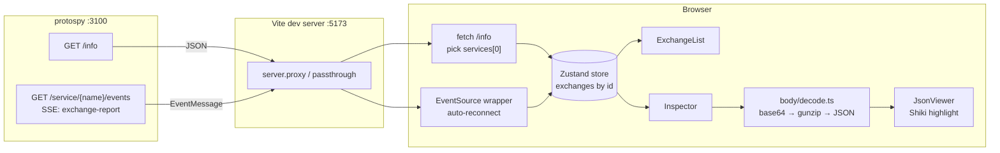

# protospy UI MVP — high-level plan

## Context

protospy currently has a Rust proxy + axum web server (port 3100) that exposes
`GET /info` and an SSE stream `GET /service/{name}/events` carrying typed
`EventMessage` JSON. There is no UI yet. The requirements
(`docs/process/ui-mvp-requirements.md`, on the `ui-mvp` branch) call for a
React SPA that subscribes to the SSE stream, lists HTTP exchanges live, and
renders side-by-side request/response bodies — with the motivating use case
being readable Elasticsearch JSON. UI sketches (`docs/process/protospy-body-
inspector_1.html`) and Industrial Light/Dark themes
(`docs/process/protospy-themes-v2_1.html`) define the visual target.

The TypeScript bindings already match the wire format: `BodyChunk.binary` is
`string` (base64) and the headers type is exported as `ProxyHeaders` (no DOM
collision).

This plan defines the front-end architecture, library choices, file layout,
tooling/CI, and verification flow for the MVP. Out of scope: prod embedding
into the Rust binary, very large bodies, browsers other than Chrome,
filtering/aggregation/search, brotli decompression, partial-body
decompression mid-stream.

## Data flow



The store is the single source of truth. Components subscribe to slices to
keep the list stable while the inspector re-renders on body chunk arrival.

## Key decisions

### Framework & build: Vite 7 + React 19 + TypeScript

Standard, fast, Chrome-only is fine. Vite's `server.proxy` handles `/info`
and `/service/*` (including SSE) into protospy on `:3100`.

### Styling: Tailwind CSS v4 + CSS variables

Tailwind v4's `@theme` directive maps cleanly onto the Industrial palette
(`--bg`, `--bg2`, `--ink`, `--accent`, JSON token colors). Light/dark via a
`data-theme` attribute on `<html>`. The sketches translate to utility
classes without fighting a component library aesthetic. Headless primitives
(Radix) only if/when we need a real disclosure or popover — not needed for
MVP.

Rejected: shadcn/MUI/Mantine (visual baggage that fights the Industrial
look); plain CSS modules (writable but slower iteration than utilities).

### State: Zustand

The exchange feed is push-driven and append-only with per-exchange
mutations as body chunks arrive. Zustand handles this cleanly with selector
subscriptions so the list doesn't re-render on every body chunk.
TanStack Query is a poor fit for SSE; keep it out and use plain `fetch` for
`/info` (one-shot at startup).

### JSON view: Shiki + custom layout

For MVP: pretty-print with `JSON.stringify(parse(text), null, 2)` and
syntax-highlight via Shiki (fast, themeable, no DOM-per-token cost like
react-syntax-highlighter). Line numbers are a CSS gutter. No folding in MVP
(not in requirements). Future: swap to CodeMirror 6 read-only when we want
folding/search/giant-doc handling.

### Body decoding pipeline

`body/decode.ts` exports `decodeBody({ contentType, contentEncoding, chunks })`
returning `{ kind: 'json'|'text'|'binary', text?: string, mediaType: string,
size: number }`.

1. Concatenate chunks into bytes. `BodyChunk.text` is UTF-8 string;
   `BodyChunk.binary` is base64 string → `Uint8Array` via `atob`.
2. If `content-encoding` is `gzip`, `deflate`, or `deflate-raw`, pipe through
   `DecompressionStream`. **Brotli is deferred** — show a "br: not
   decompressed" placeholder if encountered. (Chrome's Compression Streams
   may eventually add brotli; revisit then.)
3. **No partial decompression**. Wait until `at_end: true` before decoding.
   Until then, show a "streaming… (N bytes received)" placeholder.
4. If decoded payload is text and content-type contains `json`, attempt
   `JSON.parse` → re-serialize pretty. On parse failure, render as plain
   text.
5. Binary content-types we can't display → render a placeholder with size
   and media type.

### SSE wrapper

Built-in `EventSource` (Chrome). Listens to `exchange-report` events,
ignores `keep-alive`. `onopen`/`onerror` drive a `connection: 'connecting'
| 'open' | 'reconnecting'` flag in the store. `EventSource` auto-reconnects;
the store is preserved across reconnects (don't clear on disconnect).

### Service selection

Fetch `/info` once on mount; pick `services[0]`. If empty, show an empty
state. Multi-service is out of scope for MVP — note in the status bar which
service is being shown.

### Bindings location

Keep `bindings/` at the repo root. ts-rs already exports there and the
`ts-rs-export` pre-commit hook (`.pre-commit-config.yaml`) enforces it.
Consume from `ui/` via a tsconfig path alias + Vite alias
(`@bindings/*` → `../bindings/*`). No workspace package needed.

### Tooling, formatting, lint, test

- **Prettier 3** for autoformatting (`.ts`, `.tsx`, `.css`, `.html`,
  `.json`, `.md`). Config at `ui/.prettierrc.json`; ignore via
  `ui/.prettierignore` (mirroring `.gitignore` plus `bindings/` since those
  are generated by ts-rs).
- **ESLint 9 (flat config)** with `@typescript-eslint`,
  `eslint-plugin-react`, `eslint-plugin-react-hooks`,
  `eslint-config-prettier` (turns off stylistic rules so prettier owns
  formatting).
- **TypeScript** in strict mode; `npm run typecheck` = `tsc --noEmit -p .`.
- **Vitest** for unit tests on `body/decode.ts` and the store reducer.

Add to root `.pre-commit-config.yaml` a local hook that runs prettier and
eslint on staged `ui/**` files (matches the existing `ruff-demo` /
`pyright-demo` pattern):

```yaml
- id: prettier-ui
  name: prettier (ui)
  entry: bash -c 'cd ui && npm run format:check'
  language: system
  files: ^ui/
  pass_filenames: false
- id: eslint-ui
  name: eslint (ui)
  entry: bash -c 'cd ui && npm run lint'
  language: system
  files: ^ui/
  pass_filenames: false
```

`npm run format:check` = `prettier --check .`;
`npm run format` = `prettier --write .`;
`npm run lint` = `eslint .`.

### CI: `.github/workflows/ui-ci.yml`

Mirror the `demo-ci.yml` shape (separate `lint`, `typecheck`, `test` jobs,
path-filtered triggers). Setup uses `actions/setup-node@v4` with the version
pinned in `ui/package.json` `"engines"`, plus `actions/cache` (or
`setup-node`'s built-in npm cache) keyed on `ui/package-lock.json`.

```yaml
name: ui-ci
on:
  push:
    paths:
      - "ui/**"
      - "bindings/**"
      - ".github/workflows/ui-ci.yml"
  pull_request:
    paths:
      - "ui/**"
      - "bindings/**"
      - ".github/workflows/ui-ci.yml"
defaults:
  run:
    working-directory: ui
jobs:
  lint:        # npm ci; npm run format:check; npm run lint
  typecheck:   # npm ci; npm run typecheck
  test:        # npm ci; npm run test -- --run
```

`bindings/**` is in the path filter so changes to ts-rs output re-run
typecheck.

## File layout

```
ui/
  package.json
  package-lock.json
  vite.config.ts                # proxy /info + /service to :3100; @bindings alias
  tsconfig.json                 # strict; paths: @bindings/*, @ui/*
  tsconfig.node.json
  index.html
  postcss.config.js             # tailwind v4
  eslint.config.js              # flat config
  .prettierrc.json
  .prettierignore
  vitest.config.ts
  src/
    main.tsx
    App.tsx
    api/
      info.ts                   # GET /info, typed
      sse.ts                    # EventSource wrapper, status enum
    state/
      store.ts                  # Zustand: exchanges Map, connection, service
      reducer.ts                # apply(EventMessage) → store mutations
    body/
      decode.ts                 # concat → gunzip → parse-json → text
    components/
      AppShell.tsx              # topbar + body + statusbar
      TopBar.tsx                # logo, service path, theme toggle
      ConnectionIndicator.tsx
      ThemeToggle.tsx           # writes data-theme on <html>
      ExchangeList.tsx
      ExchangeListItem.tsx      # method/status/path/elapsed/sizes
      Inspector.tsx             # context bar + params strip + split panes
      ContextBar.tsx
      QueryParamsStrip.tsx
      BodyPane.tsx              # header + JsonViewer or text/empty state
      JsonViewer.tsx            # Shiki, line numbers
      HeadersDrawer.tsx         # collapsed by default
      StatusBar.tsx
    theme/
      tailwind.css              # @theme tokens for Industrial Light/Dark
    types/
      events.ts                 # narrow helpers around @bindings
  __tests__/                    # or co-located *.test.ts
```

## Build steps (in implementation order)

1. **Scaffold `ui/`**. `npm create vite@latest ui -- --template react-ts`,
   pin versions per CLAUDE.md ("Versioning dependencies"). Add Tailwind v4,
   Zustand, Shiki. Wire `vite.config.ts` proxy + `@bindings` alias.
2. **Tooling**. Add prettier, eslint flat config, vitest. Define `npm run`
   scripts: `dev`, `build`, `format`, `format:check`, `lint`, `typecheck`,
   `test`.
3. **Pre-commit + CI**. Add `prettier-ui` and `eslint-ui` hooks to
   `.pre-commit-config.yaml`. Add `.github/workflows/ui-ci.yml` (lint /
   typecheck / test jobs).
4. **Theme**. Translate Industrial Light/Dark CSS variables from
   `protospy-themes-v2_1.html` into `theme/tailwind.css` `@theme` blocks.
   `<html data-theme="light|dark">`, persisted to localStorage, default to
   `prefers-color-scheme`.
5. **API + SSE**. `api/info.ts` and `api/sse.ts`. SSE wrapper exposes a
   subscribe function and connection-status callback.
6. **Store**. `state/store.ts` Zustand store with
   `{ exchanges: Map<id, Exchange>, ids: number[], connection, service }`.
   `state/reducer.ts` pure function `apply(state, EventMessage)` covering
   request, response, bodydata, error events. Body chunks accumulate into
   per-direction `Uint8Array` buffers (or string for text chunks; normalize
   to bytes at decode time). Vitest covers reducer transitions.
7. **Body decode**. `body/decode.ts` per the pipeline above. Vitest using
   captured fixtures from `docs/examples/`.
8. **Components**. AppShell → TopBar → ExchangeList(Item) → Inspector
   (ContextBar, QueryParamsStrip, BodyPane×2, HeadersDrawer) → StatusBar.
   Build the layout dry first (no live data) against the sketch.
9. **Wire it together**. Mount the SSE subscription in App, push events into
   the store, select the first service from `/info`, render.
10. **Polish**. Empty states (no service, no exchanges, no body, decode
    failure). Reconnect indicator. Theme toggle.

## Concerns / things to confirm during implementation

- **gzip end-of-stream**. With `at_end: true` we have the full byte buffer;
  feed it to `DecompressionStream('gzip')` as a single chunk and read the
  full output. Async, but simple.

## Verification

End-to-end smoke test (manual; no Rust changes in this plan):

1. From repo root: `cargo run -- --proxy=name=es,port=3000,target=localhost:9200`
   (or `just run`).
2. From `demo/`: `uv run uvicorn elasticflix.main:app --reload` against ES
   on `:9200`.
3. From `ui/`: `npm run dev`. Open http://localhost:5173 in Chrome.
4. Drive traffic: `curl -i http://localhost:3000/` and
   `curl -X POST http://localhost:3000/movies/_search -d '{...}'`, plus a
   couple via the demo.
5. Confirm:
   - Exchanges appear in the list as requests arrive.
   - Selecting an exchange shows method/path/status/content-type/elapsed/
     query params/request body/response body.
   - gzip-encoded JSON response (Elasticsearch hits) decompresses and
     pretty-prints.
   - Headers are hidden by default, expandable.
   - Theme toggle flips Industrial Light ↔ Dark with no layout shift.
   - Stop and restart protospy: indicator goes red, then green again on
     reconnect; the existing list is preserved.
   - Reload Vite; UI re-syncs from `/info` and SSE.

Tooling check before committing:

```
cd ui
npm run format:check
npm run lint
npm run typecheck
npm run test -- --run
```

Unit-level: vitest covers `body/decode.ts` with fixtures from
`docs/examples/e1-*.json` and `docs/examples/e2-*.json` (gzip, plain text,
binary cases) and `state/reducer.ts` (request → response → bodydata
sequencing).

## Critical files

- New (all under `ui/`): see "File layout" above.
- New: `.github/workflows/ui-ci.yml`.
- Modified: `.pre-commit-config.yaml` (add prettier-ui / eslint-ui hooks).
- Read-only references during implementation:
  - `src/proxy/event.rs`, `bindings/*.ts` — event shape
  - `src/server/events.rs`, `src/server/info.rs`, `src/server/router.rs` —
    endpoint contract
  - `docs/examples/e1-*.json`, `docs/examples/e2-*.json` — fixtures
  - `docs/process/protospy-body-inspector_1.html` — layout
  - `docs/process/protospy-themes-v2_1.html` — palette